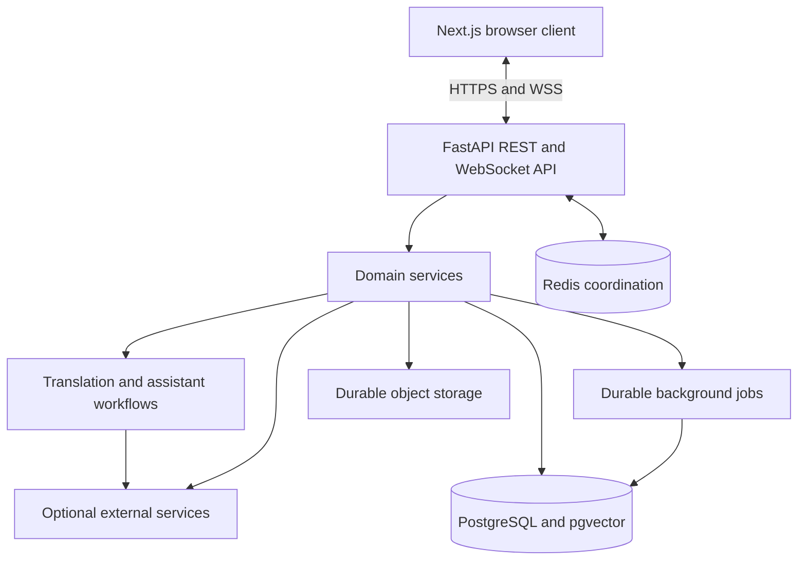

# LinguaFlow

[](https://github.com/ThuanNN68/linguaflow/actions/workflows/ci.yml)
[](LICENSE)
[](requirements.txt)
[](frontend/package.json)

LinguaFlow is an AI-powered multilingual collaboration platform that combines
real-time messaging, per-recipient translation, voice transcription, semantic
retrieval, an approval-based assistant, and an internal calendar in one
application.

**Live product:** [Open LinguaFlow](https://linguaflowchat-p5djsvn6q-4-u2.vercel.app/)

> The public deployment uses free-tier infrastructure. Its first request may be
> delayed by a cold start, and optional AI-backed features may be affected by
> provider quotas. Do not use the demo for sensitive data.

## Contents

- [Product overview](#product-overview)
- [Key capabilities](#key-capabilities)
- [System architecture](#system-architecture)
- [Core workflows](#core-workflows)
- [Technology stack](#technology-stack)
- [Reliability and security](#reliability-and-security)
- [Deployment](#deployment)
- [Development](#development)
- [Verification](#verification)
- [Repository structure](#repository-structure)
- [Documentation](#documentation)
- [Current limitations](#current-limitations)

## Product overview

LinguaFlow preserves every original message and prepares translated variants for
each recipient according to their language preference. Translation is therefore
a view of a durable conversation, not a replacement for user-authored content.

The private assistant operates inside explicit authorization and consent
boundaries. It can answer questions, summarize permitted context, transcribe
voice requests, and prepare calendar or task proposals. Side effects remain
reviewable: proposals must be completed and approved by the user before an event
or task is created.

## Key capabilities

### Messaging and collaboration

- Authenticated direct and group conversations over REST and WebSocket.
- Replies, reactions, mentions, forwarding, search, unread state, and personal
  saved messages.
- Message editing and deletion with membership and visibility enforcement.
- Attachment upload and authenticated access through local or durable object
  storage backends.
- Voice recording, upload, transcription lifecycle, retry, and transcript-aware
  assistant requests.

### Language intelligence

- Language detection and per-recipient translation without modifying the
  original message.
- Translation versions, retry handling, correction feedback, and glossary-aware
  terminology.
- Semantic retrieval through PostgreSQL and pgvector when configured.
- Controlled degradation when optional language services are unavailable.

### Assistant and calendar

- A private assistant conversation plus authorized assistant mentions in chats.
- Consent scopes for conversation access, memory, proactive analysis, and
  calendar operations.
- Durable assistant jobs that can recover after an interrupted process.
- Calendar proposals that combine nearby context and immediate follow-up
  messages.
- Newer corrections update the matching pending proposal instead of creating
  duplicate cards.
- Field-level message provenance for extracted time and details.
- Review forms that block approval until required date and time information is
  complete.
- Internal calendar events and durable reminders with claim, retry, and recovery
  behavior.

### Administration and integrations

- Role-protected administration APIs and user suspension workflows.
- Audit records for security-sensitive actions.
- Account erasure workflow with attachment cleanup and data anonymization.
- Signed outbound webhooks with persisted delivery attempts.
- Optional email, realtime calling, web push, and server-side speech services.

## System architecture



The API is organized by domain rather than by transport alone. Authentication,
messaging, attachments, calendar, intelligence, administration, voice, and
notifications each own their service boundary. PostgreSQL is the source of truth
for durable application state; WebSocket delivery is a realtime projection of
that state, not a message log.

Redis is optional for a single backend process. It becomes required when multiple
workers or replicas must share WebSocket broadcasts and distributed rate-limit
state. Production attachments use Supabase Storage or an S3-compatible backend
instead of an ephemeral container filesystem.

More detailed component, sequence, assistant, reminder, and scaling diagrams are
maintained in [System diagrams](docs/architecture/diagrams.md).

## Core workflows

### Message delivery and translation

1. The API authenticates the connection and validates conversation membership.
2. The messaging service commits the original message to PostgreSQL.
3. The sender receives an acknowledgement only after durable persistence.
4. Authorized recipients receive a WebSocket event through the local manager or
   Redis backplane.
5. Translation processing stores recipient-specific versions and publishes their
   lifecycle updates independently.

### Assistant calendar proposal

1. An authorized text request or completed voice transcript creates a durable
   assistant job.
2. A short settling window collects an immediate follow-up containing time,
   location, or notes.
3. The assistant retrieves only permitted nearby context and produces structured
   candidates.
4. Deterministic application code validates the output and either creates a
   proposal or updates the newest matching pending proposal.
5. The review UI displays extracted values and their source context.
6. Missing required time fields must be supplied before approval.
7. Only an approved and revalidated proposal creates the internal action.

### Reminder delivery

1. The scheduler atomically claims a due reminder.
2. A durable assistant notification is written to PostgreSQL.
3. The reminder is marked delivered only after that write succeeds.
4. A failed write releases the claim and schedules bounded exponential retry.
5. WebSocket notification remains best effort; reconnecting clients reload the
   durable message.

## Technology stack

| Layer | Technology |
|---|---|
| Web client | Next.js, React, TypeScript, Tailwind CSS |
| API and realtime | FastAPI, Pydantic, WebSocket |
| Persistence | PostgreSQL, pgvector, SQLAlchemy async, Alembic |
| Background processing | Durable database jobs, APScheduler |
| Distributed coordination | Redis pub/sub and shared rate limiting |
| Object storage | Supabase Storage or S3-compatible storage |
| Quality | pytest, Vitest, ESLint, Ruff, TypeScript |
| Delivery | Docker, GitHub Actions, Vercel, Render |
| Observability | Structured logs, health endpoints, OpenTelemetry support |

## Reliability and security

The implementation follows several explicit invariants:

- Database sessions are scoped to individual operations, including WebSocket
  events, so idle connections do not occupy the database pool.
- Application heartbeat and idle timeout remove half-open WebSocket clients.
- Durable writes occur before acknowledgement or broadcast.
- Client mutation identifiers support safe retry and acknowledgement correlation.
- Voice transcription, assistant processing, reminders, and webhook delivery
  persist lifecycle state rather than relying only on process memory.
- Provider calls use bounded timeouts, classified failures, retry policies, and
  circuit-breaker behavior where appropriate.
- Assistant retrieval combines authentication, membership, visibility, and
  explicit consent; vector similarity never grants authorization.
- Side-effect proposals require human approval and server-side revalidation.
- Rate limits use shared Redis state when the application runs across replicas.
- Secrets remain in local environment files or deployment secret stores and are
  excluded from logs, health responses, and public configuration.

GitHub Actions validates linting, the migration graph, backend tests, frontend
tests, TypeScript, and the production frontend build. CodeQL, dependency updates,
and secret scanning are configured under [`.github`](.github/).

See [Runtime reliability](docs/operations/reliability.md) and
[Security policy](SECURITY.md) for failure handling and responsible disclosure.

## Deployment

The public reference deployment uses:

```text
Vercel frontend
      | HTTPS / WSS
      v
Render API service
      |
      +-- Supabase PostgreSQL + pgvector
      +-- durable attachment storage
      +-- optional managed services
```

Deployment configuration is environment-specific. At minimum, a release needs a
production mode, a unique authentication secret, an async PostgreSQL connection,
the canonical frontend origin, allowed CORS origins, and the public API URL used
by the frontend build. Optional capabilities are enabled only when their service
configuration is present.

Before serving traffic, apply the current Alembic migration and verify readiness,
authentication, REST messaging, WebSocket messaging, attachment access,
assistant output, and reminder behavior. Full procedures and provider-neutral
configuration guidance are in the [Deployment runbook](docs/operations/deployment.md).

## Development

Local development is optional for evaluating the hosted product. Contributors
need Python 3.11+, Node.js 20+, and PostgreSQL 16 with pgvector.

Copy `.env.example` to `.env`, provide development database and authentication
settings, then start the API:

```powershell
python -m venv .venv
.\.venv\Scripts\Activate.ps1
pip install -r requirements.txt
alembic upgrade head
uvicorn src.main:app --reload
```

Start the client in a second terminal:

```powershell
cd frontend
npm ci
npm run dev
```

The complete configuration contract is documented in [`.env.example`](.env.example).
Real credentials must never be committed. Operational launchers and maintenance
commands are documented in [scripts/README.md](scripts/README.md).

## Verification

Backend quality gate:

```powershell
ruff check src tests eval scripts
pytest tests -q
alembic check
```

Frontend quality gate:

```powershell
cd frontend
npm test
npm run lint -- --max-warnings=0
npx tsc --noEmit
npm run build
```

The full backend suite requires PostgreSQL with the `vector` and `pg_trgm`
extensions. Database-backed tests use an isolated test database and must never
target development or production data. See [tests/README.md](tests/README.md).

## Repository structure

```text
linguaflow/
├── alembic/          Versioned database migrations
├── docs/             Architecture, API, operations, and deployment guides
├── eval/             Deterministic quality evaluation assets
├── frontend/         Next.js application
├── scripts/          Development, maintenance, and deployment utilities
├── seed/             Versioned seed data
├── src/
│   ├── agents/       Guarded language and assistant workflows
│   ├── api/          REST and WebSocket transport layer
│   ├── core/         Shared infrastructure primitives
│   ├── database/     Engine, sessions, and domain models
│   ├── schemas/      Validated API and event contracts
│   └── services/     Domain business logic
└── tests/            Unit, integration, contract, and reliability tests
```

Domain ownership and dependency direction are described in
[Service boundaries](src/services/README.md).

## Documentation

| Document | Purpose |
|---|---|
| [Documentation index](docs/README.md) | Maintained documentation map |
| [Architecture decisions](ARCHITECTURE.md) | System boundaries and design decisions |
| [System diagrams](docs/architecture/diagrams.md) | Component and workflow diagrams |
| [API contract](docs/api/contract.md) | REST, WebSocket, lifecycle, and error contracts |
| [API versioning](docs/api/versioning.md) | Compatibility and deprecation policy |
| [WebSocket recovery](docs/api/websocket-reconnect.md) | Heartbeat, reconnect, and resynchronization |
| [Feature operations](docs/operations/features.md) | Calendar, assistant, voice, files, and RTC behavior |
| [Deployment runbook](docs/operations/deployment.md) | Hosted deployment and release verification |
| [Runtime reliability](docs/operations/reliability.md) | Scaling, recovery, metrics, and incident response |
| [Contributing](CONTRIBUTING.md) | Contribution workflow and quality expectations |
| [Security policy](SECURITY.md) | Private vulnerability reporting |

## Current limitations

- Redis is required before adding backend workers or replicas; without it,
  realtime broadcasts and rate limits are process-local.
- A sleeping free-tier backend cannot deliver reminders at an exact minute. Due
  reminders are recovered after the service wakes.
- Translation, transcription, semantic retrieval, email, calling, and other
  optional capabilities depend on separately configured services and quotas.
- Calendar events are internal to LinguaFlow; external calendar synchronization
  is not part of the current release.
- Container-local attachment storage is intended for development only.
- The public deployment is an evaluation environment, not a production data
  processing service.

## Contributing

Issues and pull requests are welcome. Read [CONTRIBUTING.md](CONTRIBUTING.md)
before proposing a change, keep domain boundaries intact, add tests for changed
behavior, and update the relevant contract or runbook when behavior changes.

## License

LinguaFlow is released under the [MIT License](LICENSE).
