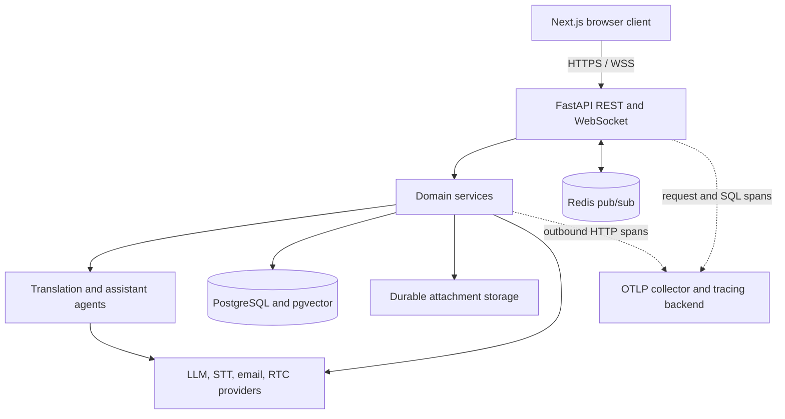
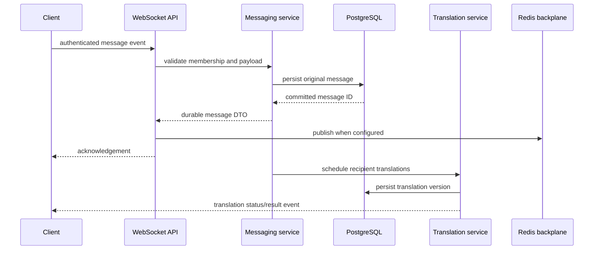
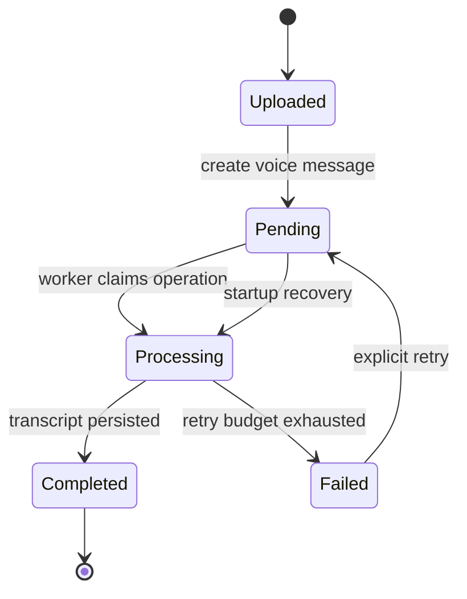
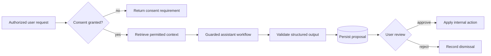
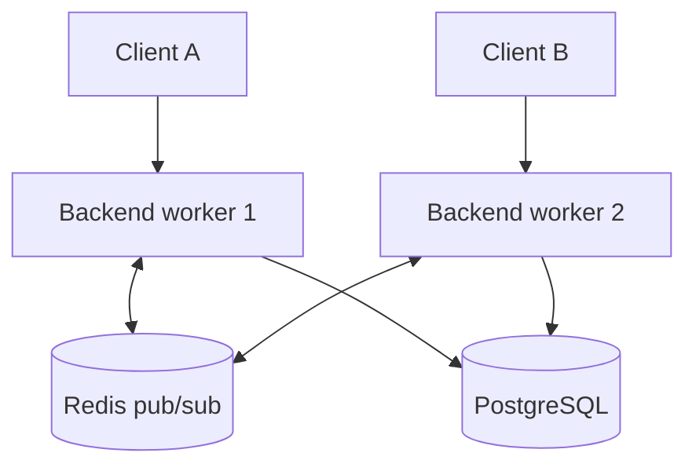
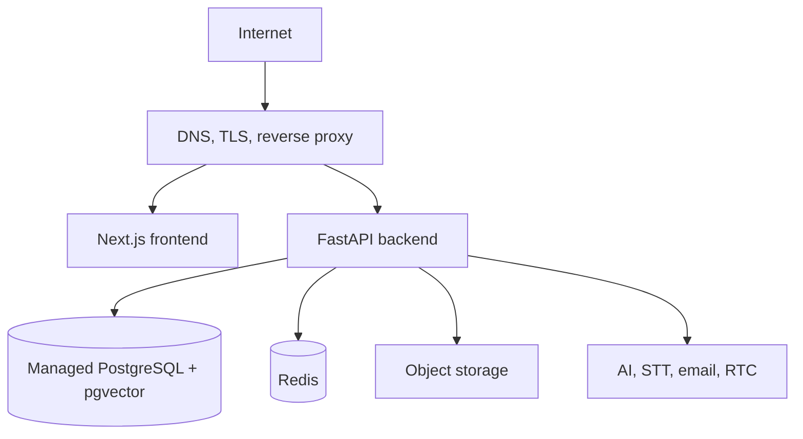

# System diagrams

These Mermaid diagrams summarize the current topology. Keep them synchronized
with `ARCHITECTURE.md`, public contracts, and migrations.

## System overview

## Message and translation flow

## Voice lifecycle

## Assistant proposal flow

## Realtime scaling

Without Redis, only clients connected to the same process receive process-local
broadcasts. Production must therefore use Redis before adding workers or replicas.

## Deployment topology

